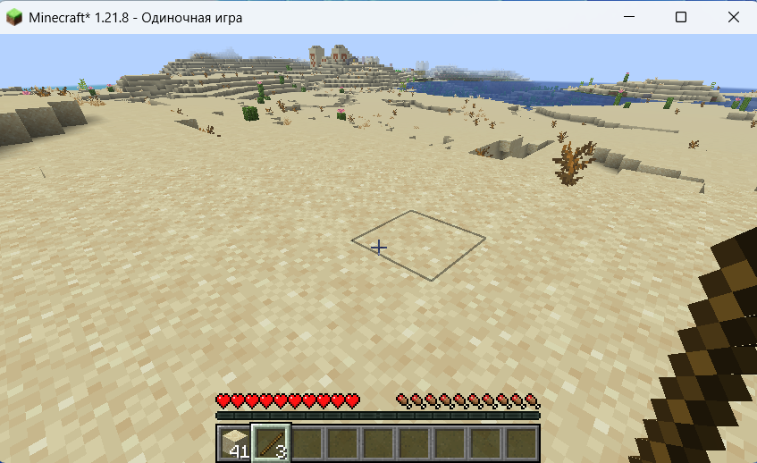

## Fabric мод под Minecraft

Разработать Fabric мод под Minecraft версии 1.21.8, API последней версии.
В качестве системы сборки использовать Gradle 8.14.



### Описание проекта
1. Простой Screen с полем ввода текстового сообщения и кнопкой отправки.
2. По нажатии на кнопку клиентом необходимо отправлять закодированное в Protobuf 3 сообщение:
```textmate
message Message {
   string text = 1;
   }
```
3. На сервере декодировать данное сообщение и записывать его содержимое в таблицу Postgres следующего вида:
```postgresql
CREATE TABLE messages (
   id SERIAL PRIMARY KEY,
   uuid UUID NOT NULL,
   text VARCHAR(256) NOT NULL
   );
```
* Где `id` — уникальное ID записи;
* `uuid` — уникальный ID игрока, который отправил данное сообщение;
* `text` — содержимое Protobuf сообщения = поле text.

### Стек технологий
1) В качестве системы сборки используется Gradle.
2) Для работы с БД применяется Hibernate.
3) Используются официальные mappings от Mojang:
```text
mappings loom.officialMojangMappings()
```
4) Для работы с Protobuf используется Google-библиотека и плагин для Gradle.
5) Для работы с GUI используется стандартное API Minecraft.


## Полный цикл тестирования
1. Запуск: Docker + IDEA
2. В игре: `M` → ввод текста → `Send`
3. Проверка: `SELECT * FROM messages;`
4. Очистка: `docker-compose down -v`

```textmate
(Minecraft) [STDOUT]: Message saved to database: MessageEntity{id=1, uuid=1fa8a2b7-811f-322e-b30d-8bfc6ccd460c, text='Привет, мир!'}
(Minecraft) [STDOUT]: Message successfully saved to database with ID: 1
```

> Если мод не загружается:
> * Проверь, что все зависимости скачаны: `.\gradlew.bat build`
> * Проверь логи в консоли IDEA
